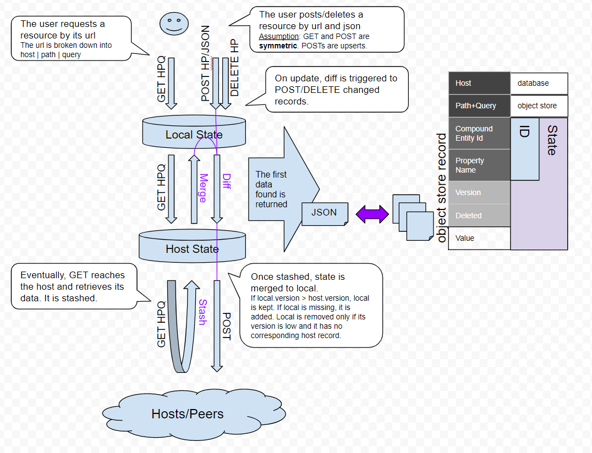

# localstate-poc
conflict-free local state inspired by [crdts](https://crdt.tech/)

To play with it,
       - install [json-server](https://github.com/typicode/json-server) and run it
       - go to [http://localhost:3000/index.html](http://localhost:3000/index.html)

